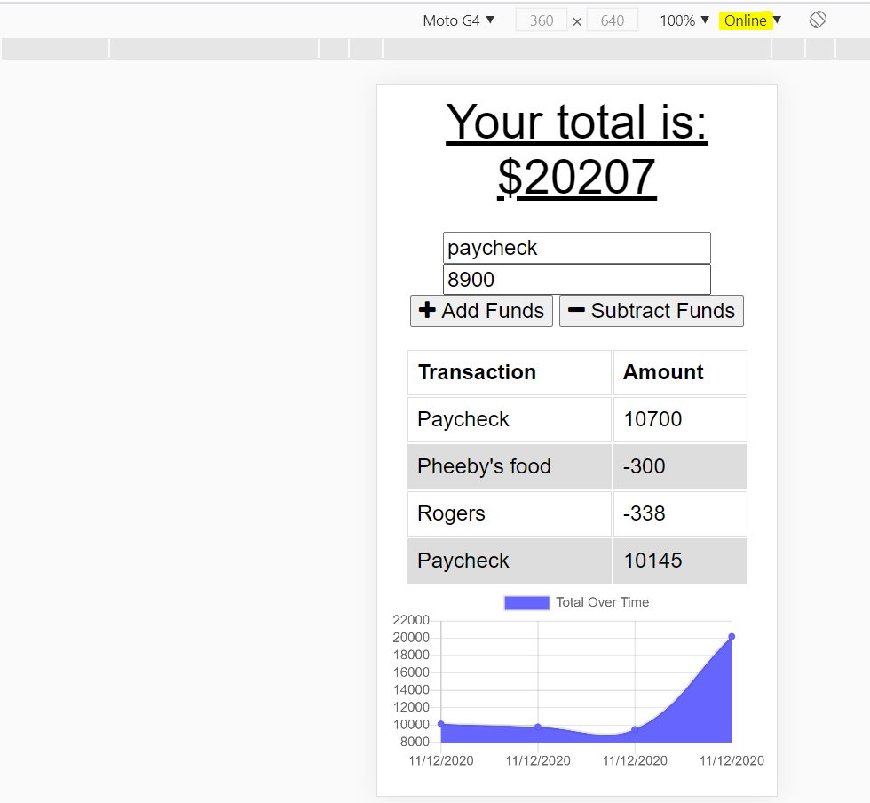
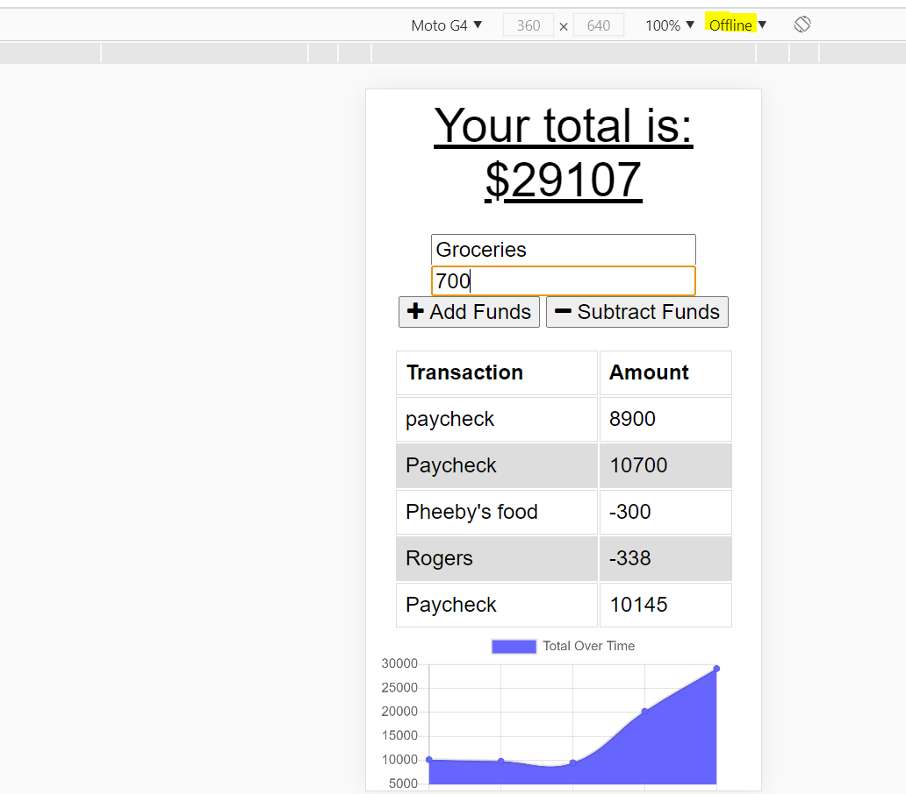
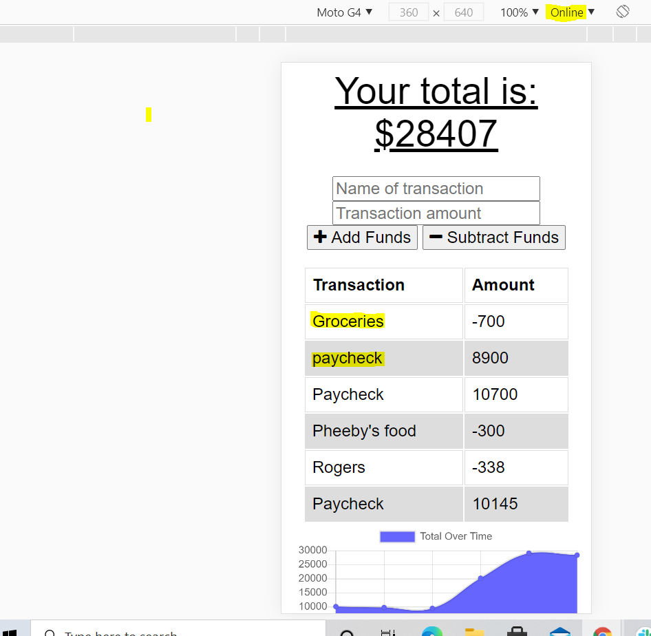

# Online/Offline Budget Trackers

[](https://opensource.org/licenses/MIT)

## Description

The scope of this project was to add functionality to the existing Budget Tracker application to allow for offline access and functionality.

## Table of Contents

* [Technologies](#technologies)
* [Installation](#installation)
* [Usage](#usage)
* [Deployment](#deployment)
* [Credits](#credits)
* [License](#license)
* [Questions](#questions)

## Technologies

- JavaScript
- NodeJs
- Express
- Mongodb
- Mongoose

## Installation

Install express, and mongodb within package.json file using `npm install` command.

The dependencies are below:

* Use the [mongodb](https://www.npmjs.com/package/mongodb),official MongoDB driver for Node.js. Provides a high-level API on top of mongodb-core that is meant for end users.

* Use [express](https://www.npmjs.com/package/express) NPM package to that provides a robust set of features for web and mobile applications.

## Usage

The application allows users to add expenses and deposits to their budget with or without a connection. When the transaction is entered in offline mode, the application populates the total when brought back online.








# Deployment

Application is deployed to heroku

```bash
  $ git commit -m "{UPDATED MESSAGE}"
  $ git push origin master
  $ git push heroku master
```

This will deploy to [heroku](https://lit-dawn-74186.herokuapp.com/) 

## Credits

**[Anjali Pant](https://github.com/Anjali9293)**

## License 

```
Copyright 2020 <Anjali Pant>

Permission is hereby granted, free of charge, to any person obtaining a copy of this software and associated documentation files (the "Software"), to deal in the Software without restriction, including without limitation the rights to use, copy, modify, merge, publish, distribute, sublicense, and/or sell copies of the Software, and to permit persons to whom the Software is furnished to do so, subject to the following conditions:

The above copyright notice and this permission notice shall be included in all copies or substantial portions of the Software.

THE SOFTWARE IS PROVIDED "AS IS", WITHOUT WARRANTY OF ANY KIND, EXPRESS OR IMPLIED, INCLUDING BUT NOT LIMITED TO THE WARRANTIES OF MERCHANTABILITY, FITNESS FOR A PARTICULAR PURPOSE AND NONINFRINGEMENT. IN NO EVENT SHALL THE AUTHORS OR COPYRIGHT HOLDERS BE LIABLE FOR ANY CLAIM, DAMAGES OR OTHER LIABILITY, WHETHER IN AN ACTION OF CONTRACT, TORT OR OTHERWISE, ARISING FROM, OUT OF OR IN CONNECTION WITH THE SOFTWARE OR THE USE OR OTHER DEALINGS IN THE SOFTWARE.
```

## Questions

For more questions about this project, click the link below to view my Github repo:

- [GitHub Profile](https://github.com/Anjali9293)

You can also reach me directly at: pantanjali7@gmail.com
